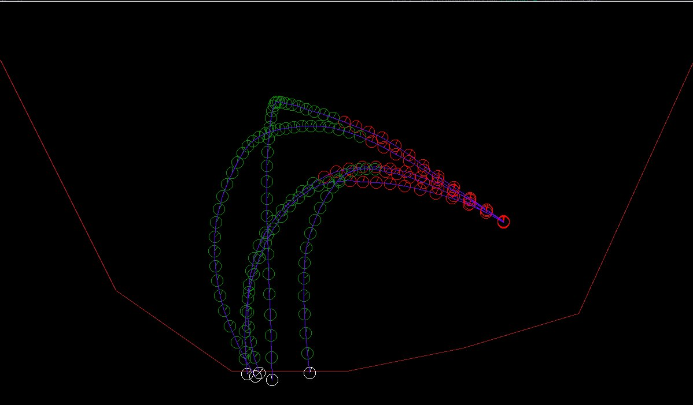

# marsLanderGA

Codingame's mars lander implemented in C++, supports two mods :
- codingame : only AI is used to find a solution in short time
- standalone : spawns a GUI made with SDL for debugging and playing around.

